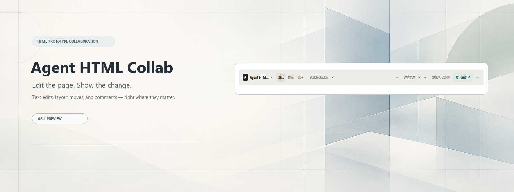

# Agent HTML Collab

### Show your ideas on the page. Refine the HTML with your agent.

[中文](README.md) · **English**

Agent HTML Collab is a collaboration tool for people and coding agents working on HTML prototypes. Edit text directly, move elements to show layout ideas, attach comments to specific elements, and hand the feedback to your agent—without describing “the second button on the left” in chat.

It works with existing HTML files and does not require a new framework or a particular model. DeepSeek Harness, OpenCode, and ZCode have different integration paths. Other clients can use the standalone page and project instructions.

## The collaboration loop

1. **Open a prototype**: open existing HTML from its project conversation, preview it, and switch pages.
2. **Give direct feedback**: right-click an element to edit its text, add a comment, or move it. Choose Done or Cancel to return to browsing.
3. **Send it to the agent**: save a JSON feedback bundle. Integrated clients deliver it to the conversation that owns the page.
4. **Review the changes**: the agent reads and processes feedback. The text apply tool offers a preview report, backups, and source updates. Refresh the page to check the result.

Automatic notification means feedback was delivered, not that the model finished changing the page. Clients without an integration require a manual handoff of the feedback file.

## What it does

- **Inline text edits, element movement, and comments**: connect text, layout ideas, and feedback to a specific page and element.
- **Single-document and multi-file prototypes**: discover project HTML automatically or configure the page list.
- **Page inspection**: browse, edit, move, and annotate modes, with zoom and a minimap.
- **Controlled feedback**: notification toggle, saving, and delivery retries without saving the same bundle twice.
- **Conversation ownership**: use a bound conversation rather than guessing from focus or the most recent chat.
- **Reviewable source updates**: generate a report, back up source before applying text changes, and archive processed feedback.

## Try it

Requires Node.js 18 or later. Run this in your HTML project directory:

```bash
npx github:noctide/agent-html-collab#v0.3.1-preview.1 serve --root .
```

Open the local Studio URL printed in the terminal. Edit, move, or annotate, then send feedback. Standalone mode saves feedback but does not automatically wake a conversation.

Click **Move** (shortcut `M`), select an element, and drag it. Hold `Shift` while dragging to lock the preview's horizontal or vertical direction; release it to move freely. Arrow keys or the panel's arrow buttons move by 1 CSS pixel; hold `Shift` for 10 pixels. Enter X/Y offsets in the movement panel or select a parent to move the containing element. Use the element menu to select a child. Choose Done to keep the preview changes or Cancel to restore the previous position. Offsets start at the element's original layout, with positive X to the right and positive Y down, regardless of preview zoom. Undo or restore an element, the current page, or all pages, and inspect movement markers. Drafts persist and support JSON import, export, and submission.

Ask your agent to read the feedback, or use the text apply tool:

```bash
# Preview the report without changing HTML
npx github:noctide/agent-html-collab#v0.3.1-preview.1 apply latest --root .

# After reviewing, apply text changes and back up the source
npx github:noctide/agent-html-collab#v0.3.1-preview.1 apply latest --root . --apply
```

The agent handles comments and element movement individually. The automatic apply tool writes only exact text matches and lists element paths and offsets in the report so the agent can review the layout before editing source. Movement previews retain the DOM hierarchy; selecting a parent changes which element moves. After `--apply` archives a bundle, its reported comments and moves still require agent processing.

## Client integrations

| Client | Workflow | Validation scope |
|---|---|---|
| DeepSeek Harness | Open the collaboration pane from the owning conversation; return feedback to that conversation | Adapted to 0.2.0-rc.2 APIs; a prior version completed a real single-conversation GUI round trip; current changes pass Host and embedded-page regressions, with updated GUI acceptance pending |
| OpenCode V2 | Install once, run `/agent-html-collab` in a conversation, and open the web link | 2.0.22 isolated backend and browser flow passed with a local model fixture; no native sidebar |
| ZCode | The repository provides a stdio MCP server and skill instructions | Protocol tests passed; the repository has no native ZCode plugin manifest, and installed-client integration is unverified |
| Other agents | Standalone Studio and project instructions with a manual feedback-file handoff | No automatic client notification promised |

Install for OpenCode:

```bash
npm install -g github:noctide/agent-html-collab
agent-html-collab install-plugin
```

Fully restart OpenCode. Run `/agent-html-collab` in the target project's conversation and `/agent-html-collab-close` when finished.

See [client integrations](docs/client-adapters.md), [OpenCode plugin](packages/opencode-plugin/README.md), and the [Host contract](docs/host-integration.md). Supporting technical documents are currently in Chinese.

## Configuration, examples, and development

- [Configuration template](studio/proto.config.json): use project `proto.config.json` to set pages, viewports, and feedback storage. Without configuration, discovery skips nested Git repositories and Studio runtime directories.
- [Single document](examples/single/) · [Multiple files](examples/multi/) · [Full example](examples/demo/)
- [Project instructions](AGENTS-SNIPPET.md) · [Agent Skill](skills/agent-html-collab/SKILL.md) · [Specification and data contract](SPEC.md)
- [Changelog](CHANGELOG.md) · [Release workflow template](docs/release-workflow.yml)

```bash
npm ci
npm test
npm run verify
npm run verify:single
npm run verify:multi
npm run verify:move
```

The current code passes 32 unit tests, 44 local-interaction checks, 45 movement checks, 41 general browser checks, 17 single-document checks, 18 multi-file checks, and 16 draft-isolation checks. Browser tests require local Chrome/Edge. Use `npm run verify:context` for local interactions, `npm run verify:move` for movement, and `npm run verify:storage` for draft isolation. See the [validation notes](research/opencode-v2-validation-notes.md) for separate OpenCode verification steps and limitations.

## Migration and compatibility from ProtoBridge

Agent HTML Collab is the renamed continuation of ProtoBridge. Existing HTML prototypes need no framework changes; existing `proto.config.json`, feedback directories, and older feedback bundles remain usable. The `moves` field in new bundles is optional, so old bundles need no conversion. `PROTOBRIDGE_HOST`, `PROTOBRIDGE_WAKE`, and the V1 `ctx.protobridge` contract remain supported as compatibility formats.

OpenCode users can install the GitHub preview and replace the old plugin:

```bash
npm install -g github:noctide/agent-html-collab#v0.3.1-preview.1
agent-html-collab install-plugin --force
```

The installer migrates this plugin's old registration to `agent-html-collab` and preserves unrelated plugin configuration. It deletes the old directory only when its `package.json` name is exactly `protobridge-opencode-plugin`. Fully restart OpenCode, then use `/agent-html-collab` and `/agent-html-collab-close`.

Browser drafts are now scoped by project root by default, while explicitly configured storage keys remain in use. Legacy shared `proto.*` drafts are neither assigned to a project nor deleted automatically; after confirming ownership, migrate them through JSON export/import. For other clients, follow the [client integration guide](docs/client-adapters.md). The install command above is for the OpenCode plugin only.
